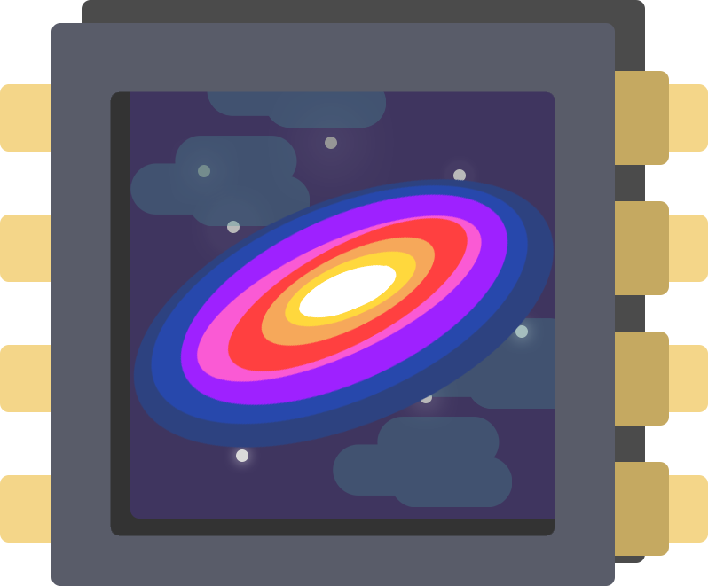
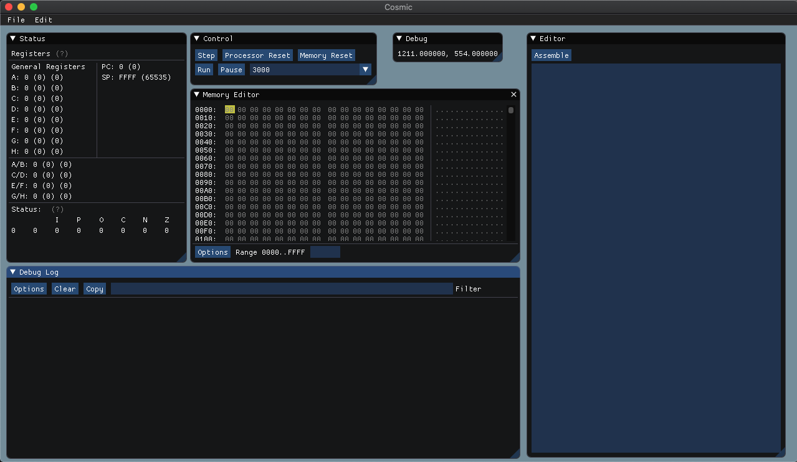

# Cosmic
<p align="center">
    <a target="_blank" rel="noopener noreferrer"></a>
<br></p>


----


<p align="center">
<a href="https://travis-ci.org/clbx/Cosmic"></a>
<a href="https://www.codefactor.io/repository/github/clbx/cosmic"></a>
<a href="https://gitter.im/CosmicProcessor/community?utm_source=badge&utm_medium=badge&utm_campaign=pr-badge"></a>

</br>
<a href="https://gitpod.io/#https://github.com/clbx/Cosmic"></a>
</p>

Cosmic is a fully simulated computer architecture that provides a full environment to use the Cosmic Processor, specialized devices, ROM, RAM, graphics, and more. The cosmic processor can also be used on a Raspberry Pi to interface with real-world devices. The cosmic system is all entirely accessible in a rich GUI interface that allows for full customization of the system environment and code execution.*

<p align="center">
    <a target="_blank" rel="noopener noreferrer"></a>
<br></p>

Cosmic is designed to act similar to a real, physical chip but take advantage of it being software-based and leaving some of the nuances of the physical world behind.*

With an instruction set that makes sense (and is fun), and simple memory-mapped I/O, Cosmic is an excellent "chip" to write for, using the cosmic assembler.*

<sub>* in deveopment</sub>

#### What is Cosmic?
* A great educational tool to teach how processors work and assembly language
* A very interesting project
* A Proof of Concept
* Kinda cool
* Fun to play with


-----

Cosmic is the Senior Project for Clay Buxton ([@clbx](https://github.com/clbx)) and Kevin Carman ([@carmank](https://github.com/carmank)) at Elizabethtown College. All academically required reports and documentation is in the ``/doc`` folder.

Special thanks to [@Gwarks](https://github.com/Gwarks), who did a lot of base work on the graphics.

----

## Documentation
* [Cosmic Processor Specification](https://github.com/clbx/Cosmic/blob/master/doc/Cosmic%20Processor%20Specifications.md). This has information about how the processor works, the instruction set, and other general information
* [Cosmic Assembler Specification](https://github.com/clbx/Cosmic/blob/master/doc/Cosmic%20Assembler%20Specifications.md). This has information about how to write assembly programs for Cosmic.
* [Cosmic System Specifications](https://github.com/clbx/Cosmic/blob/master/doc/Cosmic%20System%20Specifications.md) This has information about other parts of the Cosmic system work (Video, Audio, etc.)

## Installation Instructions
**Be sure to clone recursively, Cosmic uses git submodules**

``git clone --recursive https://github.com/clbx/Cosmic``

If you have already cloned:
```
git submodule init
git submodule update
```


### Linux
Install ``SDL2`` using your distributions package manager
```
make
```


### macOS
Install SDL2 using brew. Get brew [here](brew.sh) if you don't already have it. 
```
brew install sdl2
make
```

### Windows 
A pre-compiled binary can be downloaded from the release page. You will still need to install MinGW and SDL2
Be sure to add both MinGW and SDL2.dll to your path

**Compilation Instructions:**

Get [Chocolatey](https://chocolatey.org/install) if you don't have it already, it helps for installing tools

Install MinGW ``choco install mingw``

Install make ``choco install make``


Download SDL2 Development Library

Untar SDL to the MinGW install directory


```
make
```

Make sure any missing .dll's are in your path

### Assembler

The assembler is written in Python, so if you plan on assembling anything for Cosmic, Python 3 is required

----

``/lib`` contains some included software:
*  [ImGui](https://github.com/ocornut/imgui) is a GUI library used for the interface, along with a slightly modified memory editor addon. This is under the MIT License and the license file is included accordingly

* [ImTui](https://github.com/ggerganov/imtui) A library that takes ImGui and puts it into a terminal.

* [gl3w](https://github.com/skaslev/gl3w) A OpenGL core loader. This is under the unlicense. 

* [catch2](https://github.com/catchorg/Catch2) is used for testing. This is under the BSL Software License


SDL2 is also required to run Cosmic.


Cosmic is under the MIT License, feel free to use any part of it, but if you do please include the license file and a link to this repository.
